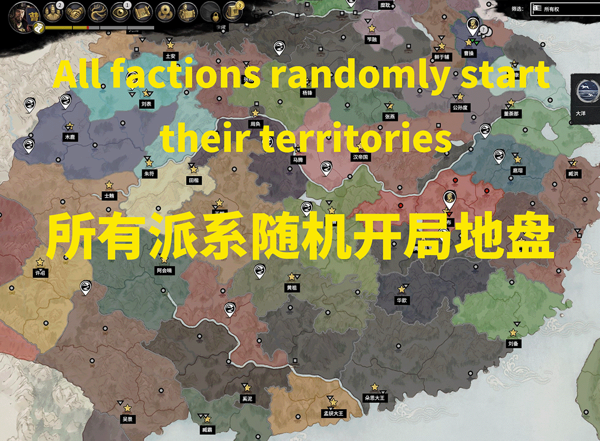

# total_war_3k_random_location
这是全面战争三国的所有派系随机开局地盘的lua脚本
steam上有可订阅的mod,mod link:https://steamcommunity.com/sharedfiles/filedetails/?id=3269436084
这个mod能够让重置所有派系地盘，适用于190，194，291剧本，不会随机分配拥有皇帝的派系，代码参考自乱世群雄mod紫虚幻镜功能。
This mod reset all factions'territory, For the 190,194,291 script，Factions with emperors will not be randomly assigned, code reference from the mod“乱世群雄”。

使用脚本实现，无需前置mod。Use script implementation, no need to pre-mod。

感谢Phantathos的代码。
